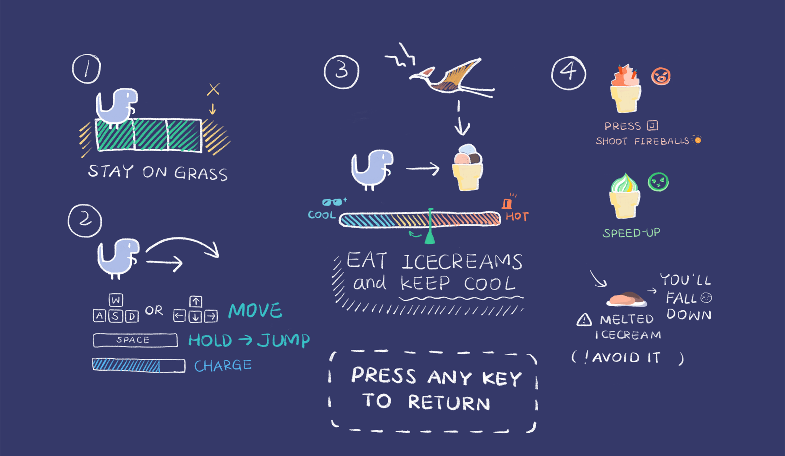

# 2D-VideoGame-Development

This repository is a project for NUS SOC Summer Workshop, developed by SWS3007 Group 3: Little Sacred Dragon Group.

The game is almost finished, to play this game, you can visit https://hahacoco.top/ with your PC or mobile phone, but the current support to the mobile devices is not very good.

This project is based on the game engine from repository Apress/build-your-own-2d-game-engine(https://github.com/Apress/build-your-own-2d-game-engine/)

## About this game: Haha & Coco

### Introduction
The global temperature is getting higher and higher, Haha, a dinosaur need to eat ice creams to decrease his body temperature, please help him!

### Rule
Try your best to eat icecreams to survive! Keep your body temperature low! 

### Operation
* WSAD or ↑↓←→: change the direction and move
* SPACE: hold to jump
* J: shoot the fireballs (if you get fire buff)  

You can also use the virtual joystick and buttons on the screen to operate if you have a touch screen.

## Gallery

## History version

Below is some history versions of this game you can visit:

- Prototype: https://hahacoco.top/records/Game_prototype_demo/public_html/

- Alpha: https://hahacoco.top/records/Alpha/public_html/

- Beta: https://hahacoco.top/records/Beta/public_html/

## Acknowledgement

Mentor: Kelvin Sung (宋贤清)

Sound material:

* http://www.aigei.com/ 爱给网
* http://www.mkcode.net/ 擅码网